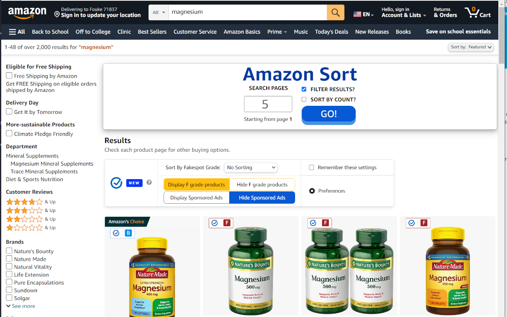

# Amazon-Sort

## Chrome Web Store

- https://chrome.google.com/webstore/detail/amazon-sort/mjfoejhcdbjmihmlbjnlgbcedpfpghpd

## Firefox Add-Ons

- https://addons.mozilla.org/en-US/firefox/addon/amazon-sort/

1. Search for anything on amazon.com
2. Once search results are shown a box will be added to page.
3. Choose how many pages to automate. 5 is default.
4. Press 'GO!' button and wait for page items to be added to memory.
5. Results are returned cheapest to highest price.
   1. If you don't want to filter your search words against the title, uncheck the box 'FILTER RESULTS'.
   2. If you would like to sort by price per count, check the 'SORT BY COUNT' box.
